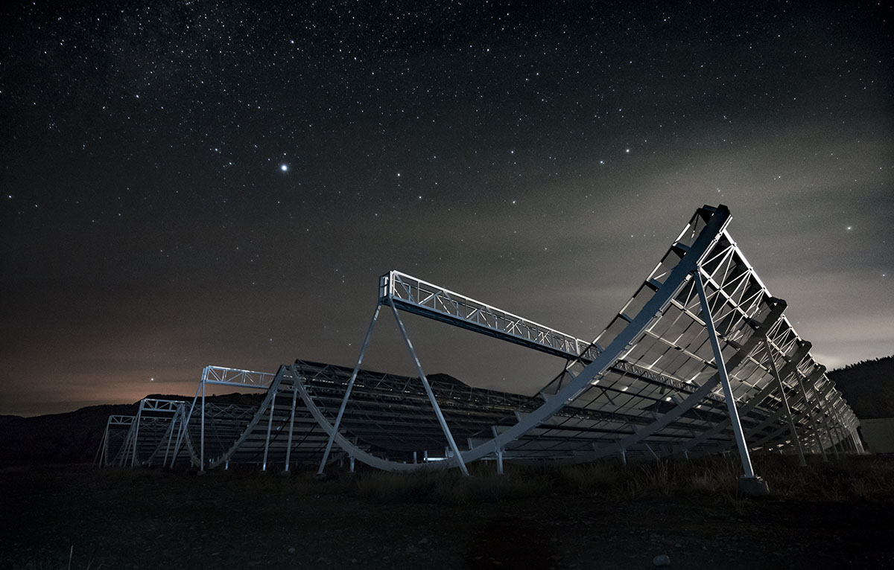

# Welcome to My Research Page

{align="left": style="height:150;width:150px"}
Welcome! My name is Evan Davies-Velie, I am a first-year Master's student at McGill University as a part of the [McGill Cosmology Instrumentation Laboratory](https://sites.google.com/a/mcgillcosmology.ca/mcgillcosmology/) led by Professor [Matt Dobbs](https://sites.google.com/a/mcgillcosmology.ca/mcgillcosmology/matt-dobbs). 

My research focuses on analyzing Fast Radio Bursts (FRBs) — powerful, millisecond-long radio pulses from deep in the universe whose origins remain largely unknown. These bursts are thought to originate from highly energetic astrophysical phenomena. I am interested in how we can use FRBs as cosmological probes to learn more about the history, evolution, and composition of the universe.

Currently, I work with [CHIME](https://chime-experiment.ca/en) (the Canadian Hydrogen Intensity Mapping Experiment), a groundbreaking radio telescope located at the NRC’s Dominion Radio Astrophysical Observatory (DRAO), located just south of Penticton, BC. Originally designed to map large-scale cosmic structures, CHIME emerged as a world leader in FRB science. In addition, I am involved in commissioning [CHORD](https://www.chord-observatory.ca/) (the Canadian Hydrogen Observatory and Radio-transient Detector), an upcoming radio telescope set to extend CHIME's capabilities with higher sensitivity, resolution, and broader frequency coverage. Together, these instruments offer unprecedented opportunities to study FRBs, map the large-scale structure of the universe, and deepen our understanding of the cosmos.

Thank you for visiting, and feel free to explore more about my journey in radio astronomy!

If you're like to learn more about me, you can find an introduction to [my research](./reasearch/index.md), some info on some [recent projects](./projects/index.md) and some more info [about me](./about/index.md).

CHIME is a novel radio telescope that has no moving parts. Originally conceived to map the most abundant element in the universe - hydrogen - over a good fraction of the observable universe, this unusual telescope is optimized to have a high "mapping speed", which requires a large instantaneous field of view (~200 square degrees) and broad frequency coverage (400-800 MHz). The digitized signals collected by CHIME will be processed to form a 3-dimensional map of hydrogen density, which will be used to measure the expansion history of the universe. At the same time, these signals can be combed for fast, transient radio emission, making CHIME a unique telescope for discovering new "Fast Radio Bursts" and for monitoring many pulsars on a daily basis.
